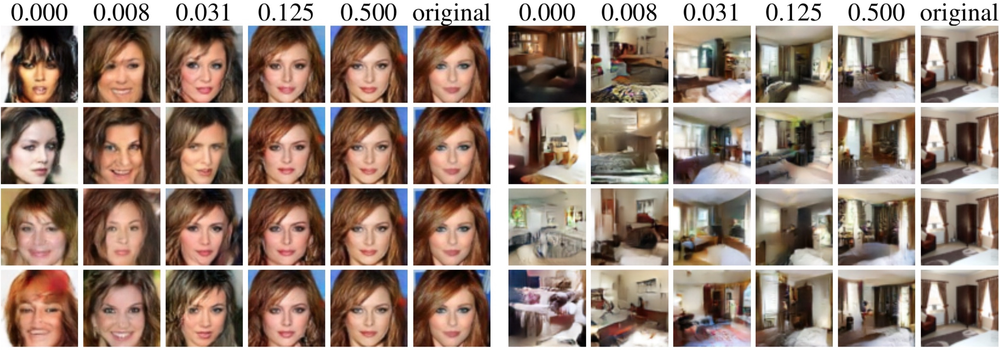

# Deep Generative Models for Distribution-Preserving Lossy Compression

  

### [[Paper]](https://arxiv.org/abs/1805.11057) [[Citation]](#citation) [[Poster]](https://github.com/mitscha/dplc/blob/master/figs/poster.pdf)

PyTorch implementation of **Deep Generative Models for Distribution-Preserving Lossy Compression** (NIPS 2018), a framework that unifies generative models and lossy compression. The resulting models behave like generative models at zero bitrate, almost perfectly reconstruct the training data at high enough bitrate, and smoothly interpolate between generation and reconstruction at intermediate bitrates (cf. the figure above, the numbers indicate the rate in bits per pixel).

## Prerequisites

- Python 3 (tested with Python 3.6.4)
- PyTorch (tested with version 0.4.1)
- [tensorboardX](https://github.com/lanpa/tensorboardX)

## Training

The training procedure consists of two steps

1. Learn a generative model of the data.
2. Learn a rate-constrained encoder and a stochastic mapping into the latent space of the of the fixed generative model by minimizing distortion.

The `train.py` script allows to do both of these steps.

To learn the generative model we consider [Wasserstein GAN with gradient penalty (WGAN-GP)](https://arxiv.org/abs/1704.00028), [Wasserstein Autoencoder (WAE)](https://arxiv.org/abs/1711.01558), and a combination of the two termed Wasserstein++. The following examples show how to train these models as in the experiments in the paper using the [CelebA](http://mmlab.ie.cuhk.edu.hk/projects/CelebA.html) data set (see `train.py` for a description of the flags).

WGAN-GP:

    python train.py --dataset celeba --dataroot /path/to/traindata/ --testroot /path/to/testdata/ --cuda --nz 128 \
        --sigmasqz 1.0 --lr_eg 0.0001 --lr_di 0.0001 --beta1 0.5 --beta2 0.9 --niter 165 --check_every 100 \
        --workers 6 --outf /path/to/results/ --batchSize 64 --test_every 100 --addsamples 10000 --manualSeed 321 \
        --wganloss

WAE:

    python train.py --dataset celeba --dataroot /path/to/traindata/ --testroot /path/to/testdata/ --cuda --nz 128 \
        --sigmasqz 1.0 --lr_eg 0.001 --niter 55 --decay_steps 30 50 --decay_gamma 0.4 --check_every 100 \
        --workers 8 --recloss --mmd --bnz --outf /path/to/results/ --lbd 100 --batchSize 256 --detenc --useenc \
        --test_every 20 --addsamples 10000 --manualSeed 321

Wasserstein++:

    python train.py --dataset celeba --dataroot /path/to/traindata/ --testroot /path/to/testdata/ --cuda --nz 128 \
        --sigmasqz 1.0 --lr_eg 0.0003 --niter 165 --decay_steps 100 140 --decay_gamma 0.4 --check_every 100 \
        --workers 6 --recloss --mmd --bnz --outf /path/to/results/ --lbd 100 --batchSize 256 --detenc --useenc \
        --test_every 20 --addsamples 10000 --manualSeed 321 --wganloss --useencdist --lbd_di 0.000025 --intencprior

To learn the rate-constrained encoder and the stochastic mapping run the following (parameters again for the experiment on the CelebA data set):

    python train.py --dataset celeba --dataroot /path/to/traindata/ --testroot /path/to/testdata/ --cuda --nz 128 \
        --sigmasqz 1.0 --lr_eg 0.001 --niter 55 --decay_steps 30 50 --decay_gamma 0.4 --check_every 100 \
        --workers 6 --recloss --mmd --bnz --batchSize 256 --useenc --comp --freezedec --test_every 100 \
        --addsamples 10000 --manualSeed 321 --outf /path/to/results/ --netG /path/to/trained/generator \
        --nresenc 2 --lbd 300 --ncenc 8

Here, `--ncenc` determines the number of channels at the encoder output (and hence the bitrate) and `--lbd` determines the regularization strength of the MMD penalty on the latent space (has to be adapted as a function of the bitrate).

In the paper we also consider the [LSUN bedrooms](https://github.com/fyu/lsun) data set. We provide the flag `--lsun_custom_split` that splits off 10k samples for the LSUM training set (the LSUN testing set is too small to compute the FID score to asses sample quality). Otherwise, training on the LSUN data set is as outlined above (with different parameters).

## Citation

If you use this code for your research, please cite this paper:

    @inproceedings{tschannen2018deep,
        Author = {Tschannen, Michael and Agustsson, Eirikur and Lucic, Mario},
        Title = {Deep Generative Models for Distribution-Preserving Lossy Compression},
        Booktitle = {Advances in Neural Information Processing Systems (NeurIPS)},
        Year = {2018}}
